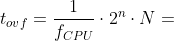

# Lab 3: Interrupt usage

<!--

-->

### Learning objectives

After completing this lab you will be able to:

* Use `#define` compiler directives
* Use internal microcontroller timers
* Understand overflow
* Combine diferent interrupts

The purpose of the laboratory exercise is to understand the function of the interrupt, interrupt service routine, and the functionality of timer units. Another goal is to practice finding information in the MCU manual; specifically setting timer control registers.

### Table of contents

* [Pre-Lab preparation](#preparation)
* [Part 1: Synchronize repositories and create a new project](#part1)
* [Part 2: Timer overflow](#part2)

* [Part 3: Polling and Interrupts](#part3)
* [Part 4: Final application](#part4)
* [Experiments on your own](#experiments)
* [Post-Lab report](#report)
* [References](#references)

## Preparation tasks (done before the lab at home)

Consider an n-bit number that we increment based on the clock signal. If we reach its maximum value and try to increase it, the value will be reset. We call this state an **overflow**. The overflow time depends on the frequency of the clock signal, the number of bits, and on the prescaler value:

&nbsp;

&nbsp;

1. Calculate the overflow times for three Timer/Counter modules that contain ATmega328P if CPU clock frequency is 16&nbsp;MHz. Complete the following table for given prescaler values. Note that, Timer/Counter2 is able to set 7 prescaler values, including 32 and 128 and other timers have only 5 prescaler values.

   | **Module** | **Number of bits** | **1** | **8** | **32** | **64** | **128** | **256** | **1024** |
   | :-: | :-: | :-: | :-: | :-: | :-: | :-: | :-: | :-: |
   | Timer/Counter0 | 8  | 16u | 128u | -- | 1024u | -- | 4096u | 16384u |
   | Timer/Counter1 | 16 | 4096u | 32768u | -- | 262144u | -- | | |
   | Timer/Counter2 | 8  | 16u | 128u | 512u | 1024u | 2048u | 4096u | 16384u |

