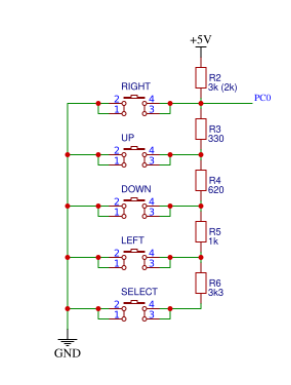
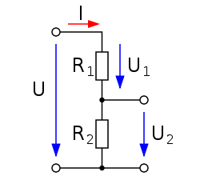

## Pre-Lab preparation

1. Use schematic of the [LCD keypad shield](https://oshwlab.com/tomas.fryza/arduino-shields) and find out the connection of five push buttons: Select, Left, Up, Down, and Right.

2. Remind yourself, what a [voltage divider](https://www.allaboutcircuits.com/tools/voltage-divider-calculator/) is.

