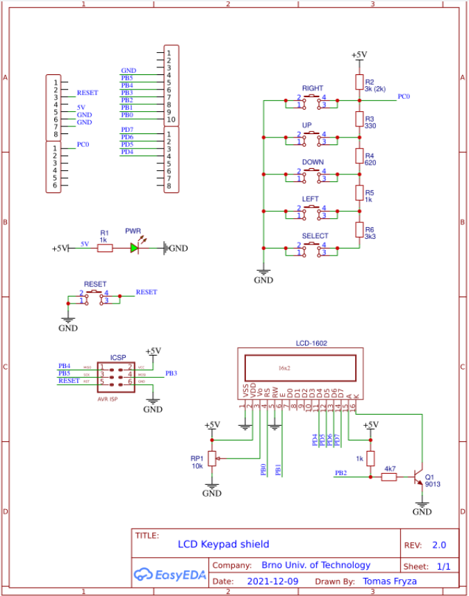
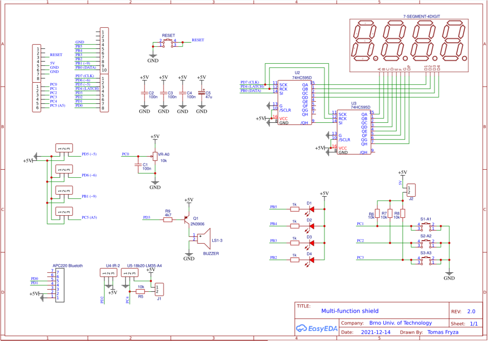
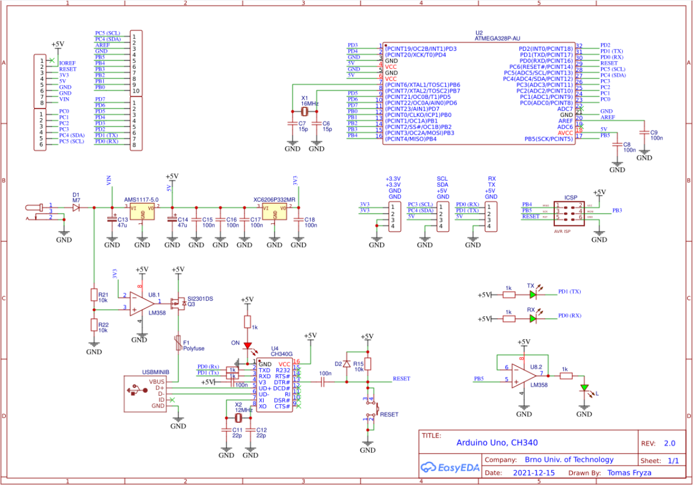

## Pre-Lab preparation

1. Use schematic of the [Arduino Uno](https://oshwlab.com/tomas.fryza/arduino-shields) board and find out on which Arduino Uno pins the SDA and SCL signals are located.

2. Remind yourself, what the general structure of [I2C address and data frame](https://www.electronicshub.org/basics-i2c-communication/) is.

